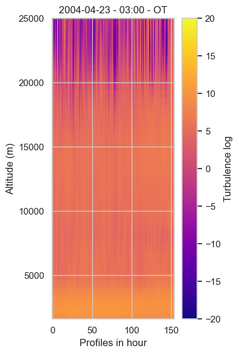
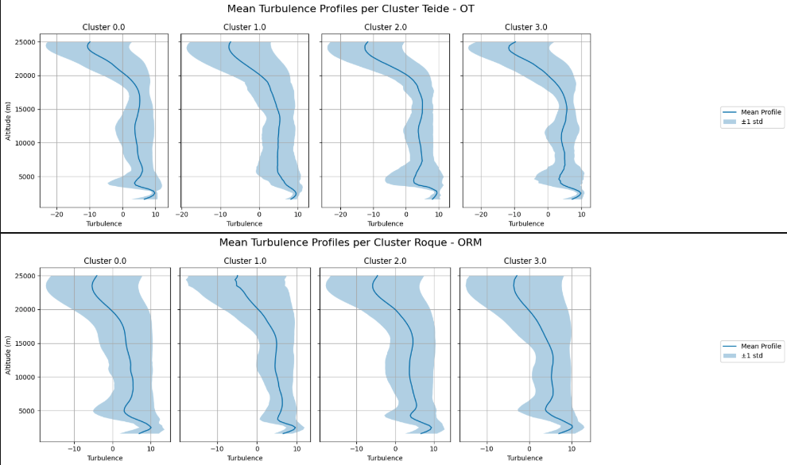
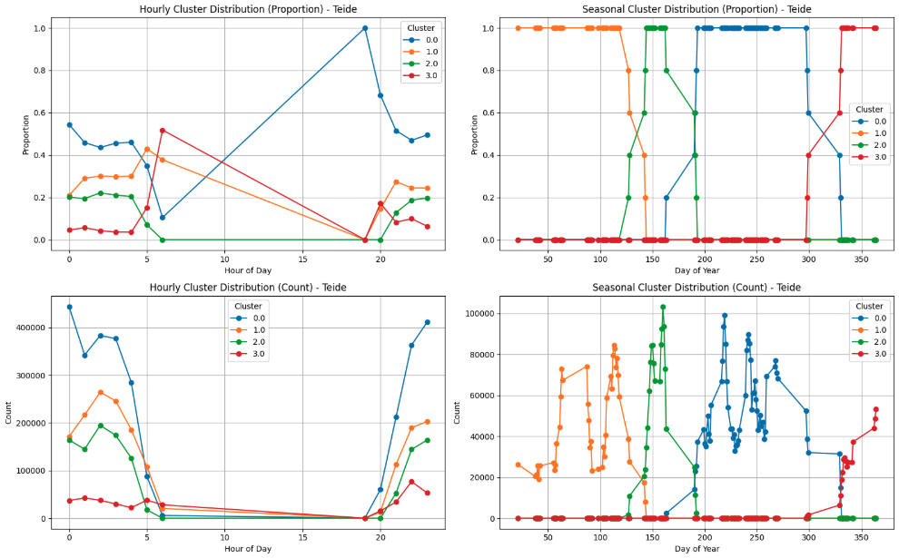
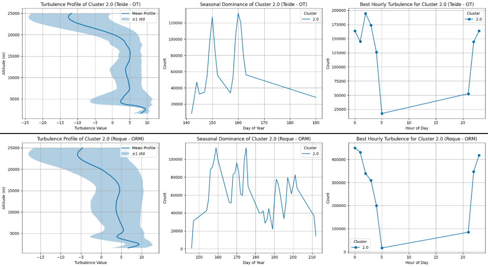

# Unsupervised pattern extractor.

## Table of Contents
- [Overview](#overview)
- [Features](#features)
- [Screenshots](#screenshots)
- [Installation](#installation)
- [Usage](#usage)
- [Contributing](#contributing)
- [License](#license)

## Overview
This project analyses vertical profiles of atmospheric turbulence using unsupervised deep learning techniques. Hourly heatmaps are generated from turbulence measurements across altitude levels and then transformed into multi-channel tensors to serve as input for models like CNN-EfficientNetB1 in this case, but instead of classification, the CNN is used as feature extractor of useful info for clustering.

## Features
| Feature                     | Description                                                                               |
|-----------------------------|-------------------------------------------------------------------------------------------|
| 🌪 Profile Processing       | Converts turbulence profiles into hourly heatmaps.                                        |
| 🧩 Feature extractor        | Use CNN layers BUT as feature extractor from generated heatmaps                           |
| 🧠 Temporal Deep Learning   | Uses models such as EfficientNetB1+advprop weights to learn time-dependent patterns.      |
| 🌈 Multi-Channel Tensors    | Includes seasonality day-of-year encoded as sine/cosine channels.                         |         
| 🔍 Unsupervised Clustering  | Extracts features and clusters patterns without labeled data.                             |

## Screenshots
Here is an example of a turbulence heatmap as graphic generated from the data, then a greyscale png to be used in a tensor channel:




Some graphics generated during the clusters analysis:






## Installation

1. Clone this repository:
   ```bash
   git clone https://github.com/AiramSalas/Atmospheric_Turbulence_Clustering.git
   cd Atmospheric_Turbulence_Clustering

2. Install dependencies
   pip install -r requirements.txt

## Usage

1. Load main Dataframes for both observatories, OT - Teide and ORM - Roque

2. Use the provided notebooks to:

   - Generate hourly heatmaps from raw profile data.

   - Create multi-channel tensors.

   - Use pre-trained model for unsupervised feature extraction and explore clustering results.

3. Visualise results using the provided notebook.

##Contributions

Contributions are welcome! Feel free to open an issue or submit a pull request with improvements or suggestions.

## License
****************************************************************************
# *** These data are protected by the Instituto de Astrofisica de Canarias ***
# ***                           COPYRIGHT (C)                              ***
# ****************************************************************************


